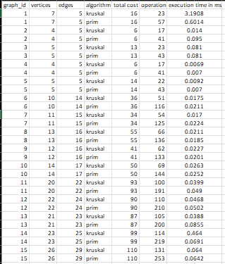

<h1>Summary of input data and algorithm results<h1>

There shows exectution time, operations and total cost of MST
To evaluate the performance of the Prim and Kruskal algorithms, three datasets with different sizes and graph data were tested(small, meduim and large)

Summary:
- Both algorithms gave the same cost
- Kruskal is faster due union-find structure

<h1>Theory vs Practice</h1>
- Approach: Kruskal builds MST by sorting all edges. Prim builds MST by checking and adding nearet vertex
- Complexity: Kruskal's O(E log E), Prim's O(E log V)
- Data structure: Kruskal uses union-find, Prim uses Priority Queue
- Performance: Prim performs more operations but is more efficient on large graphs. Kruskal performs fewer operations and usually runs faster on small or sparse graphs. However, in large graphs, the time difference between them becomes minimal.

<h1>Conclusion</h1>
Both algorithms give the same MST cost for connected graphs, which proves their correctness.
For small graphs, they perform approximately the same.

For dense graphs (many edges), Prim’s algorithm performs better because it efficiently handles numerous edge connections without sorting all edges.
For sparse graphs (few edges), Kruskal’s algorithm is more efficient since it sorts fewer edges and uses a union–find structure.

In practice, Prim’s algorithm is preferred for dense networks, while Kruskal’s algorithm works best for sparse networks such as road systems.

References:
- https://www.geeksforgeeks.org/dsa/kruskals-minimum-spanning-tree-algorithm-greedy-algo-2/
- https://www.geeksforgeeks.org/dsa/prims-minimum-spanning-tree-mst-greedy-algo-5/
- https://habr.com/ru/companies/naumen/articles/228279/
